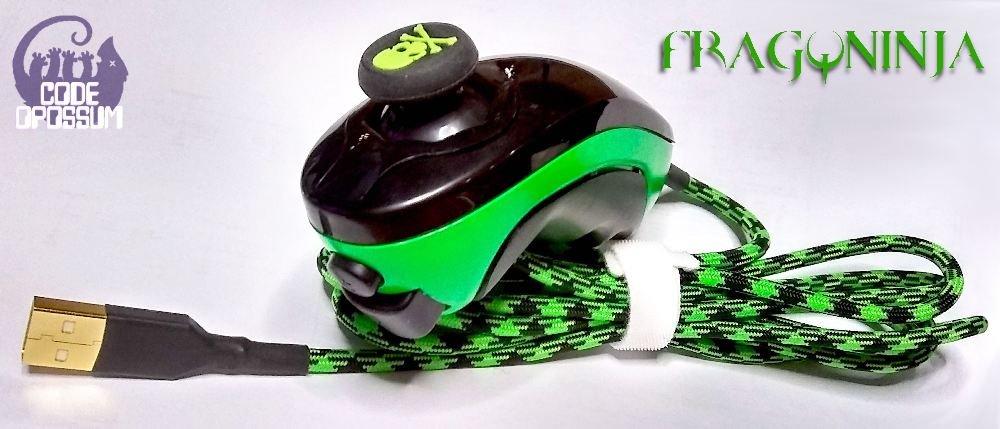
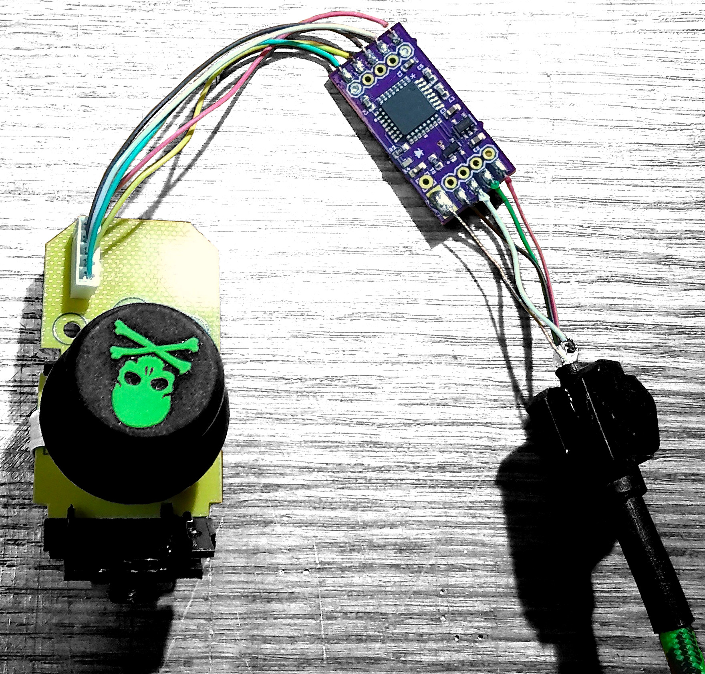

# Frag-Ninja

Wii Nunchuk 2 USB HID device, modchip repo. 

This board prototype should fit **in** a wii Nunchuk controller, ~~*I did not double check the clearance*~~.  

The Goal is to use the Nunchuk controller as a USB HID keyboard *OR* USB HID Gamepad, after connecting the *mod-chip*. 
The nunchuk also has 3 axis motion control. *(This, I'm not interested in)*.

[Digikey Cart with Reference Designators](https://www.digikey.com/short/zw3pv2)

[*I'm not making kits, its too much work*](https://memegenerator.net/img/instances/65580880/not-sure-if-its-too-much-work-or-im-just-too-lazy.jpg)

---

### Notes
~~Using the the controllers attached cable is an option~~, but I opted for a new, longer, shielded, USB cable.

USB cable assembly parts purchased from [ZapCables.com](https://zapcables.com/diy-usb-cable-kit/)

- Cable length: ~~3ft~~, 6'
- USB Type-A connector (Gold Plated)
- Cord color: ~~'Acid Purple'~~, 'Viper'
- Double Sleeving: ~~Techflex, Ogre~~, None
- HeatShrink: ~~Purple~~, Black

Cable Build Guide: https://zapcables.com/content/zap-diy-usb-cable-kit-guide-v1.pdf

- **I think I linked the wrong LED in the BOM**.

---
### To Flash The Adafruit Bootloader

Solder Wires to **SWCLK & SWDIO**. Vref connects to pad **VCC** (this is 3.3vdc). Then supply 5vdc to the **5v** pad, and ground to the **GND** pad

I used this [Guide](https://learn.adafruit.com/how-to-program-samd-bootloaders/trinket-m0-wiring) & this [Guide](https://learn.adafruit.com/how-to-program-samd-bootloaders/programming-the-bootloader-with-atmel-studio) as a reference. Since Frag-Ninja is basically a clone of the *Trinket M0*, the procedure is exactly the same.

---

#### See Bill of Materials for board assembly part numbers.

- [Wii Nunchuck Controller](https://www.amazon.com/gp/product/B07RLBN9Z2)
- [Analog Thumb Stick Caps](https://www.amazon.com/gp/product/B07Q2B2VY4)
- [Skull Cap Covers](https://www.amazon.com/gp/product/B07GS95TD1)

### More Info
This 'mod-chip' is based on the *adafruit Trinket M0*, as a result I am able to use their boot-loader & arduino libs. This makes life just a tad bit easier (less code). 

*Big thanks to Adafriut for all of their hard work and great products.*

## Work in Progress

-  Boards have been ordered (9/13/2020)
   - BOARDS CAME! (9/26/2020)
---
-  Parts have been ordered (9/13/2020)
---
-  USB Cable kit has been ordered (9/13/2020)
   - *Cable Assembled, I should have got a 5' cable (9/17/2020)*
      - *was replaced with a 6' cable (9/23/2020)*
---	  
- **NEED TO ASSEMBLE THE PCB**
   - *PCB assembled (9/26/2020)*
---   
- **NEED TO BURN THE BOOTLOADER**
   - *Bootloader burned (9/26/2020)*
---   
- **NEED TO TEST THE HARDWARE**
   - *Tested and working (9/26/2020)*
---   
- **NEED TO FLASH CODE**
   - *Code tested & working (9/26/2020)*
---   
- **NEED TO HACK APART A WII Nunchuk**
   - *Gave a new white controller a fresh coat of lime green paint (9/24/2020)*
   - *Test fitted an **Xbox 360** after-market 'Analog Thumb Stick Cap' (9/24/2020)*.
   - *Frag-Ninja ModChip installed and working (9/26/2020)*
---
- **NEED TO FRAG!**

# WHY!?

Because I can't find a cheap joystick! I guess they aren't cool anymore or something.

# Copyright

Everything in this repo is released under Creative Commons Attribution-ShareAlike 2.5 Generic (CC BY-SA 2.5).

Comes as is, no warranty. I am also not responsible for any spontaneous time travel or combustion.